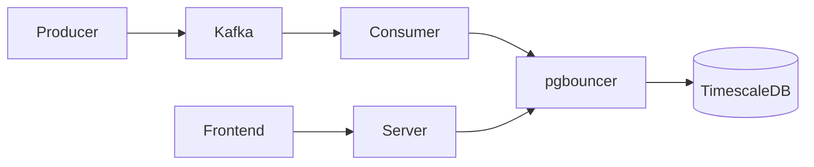

# Mock Log System

This repo is a prototype of what a logging system could look like. It's inspired by what I imagine something like Humio does at a very basic level. You can spin everything up with `docker compose up`. The frontend will be viewable at `localhost:8081`.

The producer and consumer are C++ services that generate and handle logs, respectively. I added a Kafka pipeline between the two as a way to better distribute log handling, and also as a way to learn Kafka myself. The consumer writes to the TimescaleDB database (for time series data) using pgbouncer to handle connections. The frontend then queries the db through a C++ server with custom HTTP handling.
